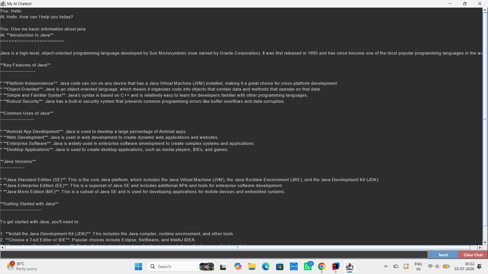

# 🤖 MyChatbot

MyChatbot is a Java-based application designed to generate AI-powered responses. This project utilizes **Java Swing** to provide an interactive and user-friendly Graphical User Interface (GUI). ✨

## 📸 Project Preview
You can see the chatbot interface below:



## 🚀 Features
* **AI-Powered Chat**: Uses the Groq API to generate real-time AI responses. 🧠
* **Responsive GUI**: Built with `javax.swing` (JTextArea and JTextField) for a seamless chat experience. 🖼️
* **Async Processing**: Implements `SwingWorker` to handle API calls in the background, ensuring the GUI remains responsive without freezing. ⚡
* **Efficient Data Handling**: Uses the `Jackson Databind` library to process and parse JSON data from the API. 📦

## 🛠️ Prerequisites
* **Java Development Kit (JDK) 21** or higher. ☕
* **Apache Maven** (for project building). 🏗️
* **IntelliJ IDEA** (or any preferred Java IDE). 💻

## ⚙️ Setup Instructions

1. **Clone the repository:**
   ```bash
   git clone [https://github.com/shiva/](https://github.com/shiva/)[Your-Repo-Name].git
